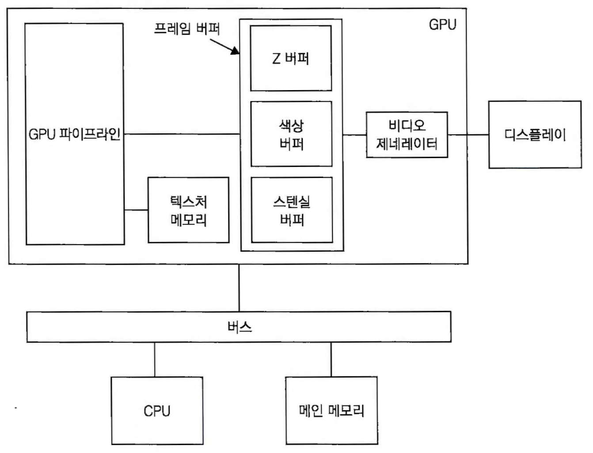
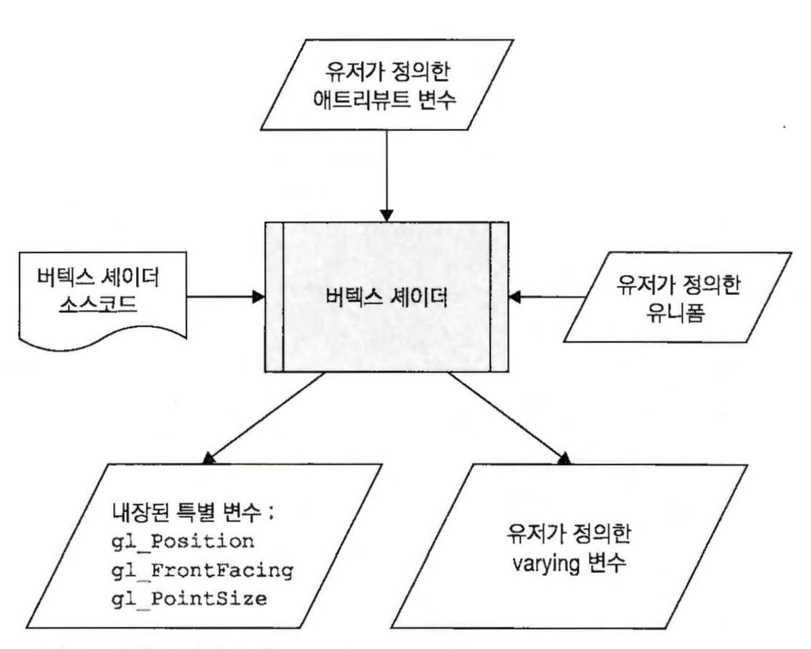
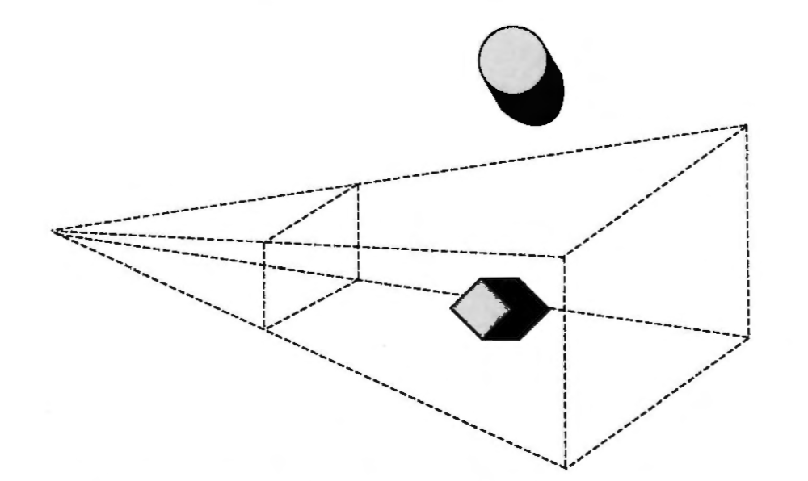
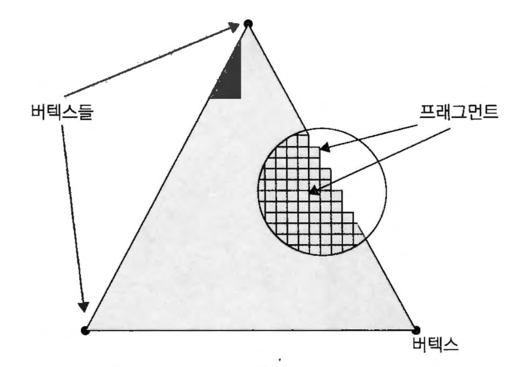

# WebGL Basic
브라우저에서 GPU 프로그래밍을 가능하게 하는 플랫폼

## CPU vs GPU

### Core

- CPU : 직렬처리 고성능 core ( 1,2,4~ )
- GPU : 병렬처리 저성능 core ( 수천~ )

### GPU 구조


## WebGL 파이프라인


### 버텍스셰이더
- 3D모델링 데이터가 처음으로 진입하는 단계
- 정점의 변환이 이루어짐 ( [변환행렬](https://www.google.co.kr/imgres?imgurl=https://upload.wikimedia.org/wikipedia/commons/thumb/2/23/2D_affine_transformation_matrix-ko-001.svg/1200px-2D_affine_transformation_matrix-ko-001.svg.png&imgrefurl=https://ko.wikipedia.org/wiki/%25EB%25B3%2580%25ED%2599%2598%25ED%2596%2589%25EB%25A0%25AC&h=1600&w=1200&tbnid=aUFBWArxnKq_QM:&q=%ED%96%89%EB%A0%AC%EB%B3%80%ED%99%98&tbnh=160&tbnw=119&usg=AI4_-kSomHnfAkwEpSE10HFm5CG1pAHXdQ&vet=12ahUKEwi29Yv8qcXeAhXExLwKHTKxBhoQ_B0wF3oECAUQEA..i&docid=s3MLlgHSQw77OM&itg=1&sa=X&ved=2ahUKEwi29Yv8qcXeAhXExLwKHTKxBhoQ_B0wF3oECAUQEA) )
- 사용자에 의해 정의 됨

#### 버텍스셰이더 구조


#### 버텍스셰이더 변수
- attribute : 사용자가 버텍스셰이더에 전달하는 변수
- uniform : 모든 버텍스들에게 사용되는 전역 상수
- varying : 버텍스셰이더가 프래그먼트에게 전달하고자 하는 사용자 정의 변수

#### 버텍스셰이더 소스코드
```
attribute vec4 a_position;
void main(){
    gl_Position = a_position;
}
```

#### 버텍스셰이터 처리 흐름


### 프리미티브 어셈블리

- 셰이딩된 버텍스를 조립해 삼각형이나 선, 포인트 등의 기하 프리미티브를 생성한다.
- 해당 프리미티브가 모니터상에 표현될 3D공간안에(뷰절두체) 위치하는지를 결졍
- 뷰절두체 안에 있는 프리미티브는 다음 단계의 파이프라인으로 보내진다.
- 뷰절두체 밖의 프리미티디브는 완전히 제거
- 뷰절두체 경계에 위치한 프리미티브는 뷰절두체 안의 형태만 남게된다.

### 단편화(레스터화)

연속적인 데이터를 컴퓨터가 표현할 수 있는 단위로 변환 (프래그먼트)

### 프래그먼트 vs 픽셀
- 픽셀 : 디스플레이에 표출된 그래픽의 최소단위
- 프래그먼트 : 픽셀을 표현하기 위한 webgl 자료 

### 프래그먼트셰이더
프리미티브에 색을 채우는 단계

#### 프래그먼트 셰이더 구조

#### 프래그먼트 셰이더 변수
- uniform : 모든 프래그먼트에게 사용되는 전역 상수
- varying : 버텍스셰이더에게 전달 받은 사용자 정의 변수
#### 프래그먼트셰이더 소스코드
```
precision mediump float;
void main() {
  gl_FragColor = vec4(1, 0, 0.5, 1);
}
```
### 프래그먼트 연산
프래그먼트의 변형이나 유효성을 테스트하는 과정
- 가위 테스트 : 프래그먼트가 설정된 scissor 박스 안에 위치하는지를 판단해서 불필요한 프래그먼트는 제거
- 멀티샘플 프래그먼트 연산 : 프래그먼트의 알파값 조정 (안티엘리어싱)
- 스탠실 테스트 : 스텐실 버퍼 기반 유효성 판단 (마스크)
- 깊이버퍼 테스트 : 시스템에서 생성되는 깊이버퍼 기반으로 가려짐 테스트
- 블랜딩 : 이전에 씌여진 색과 혼합(합성)
- 디더링 : 정밀도 범위 내에서의 색상 보정

## 삼각형 출력

1. webgl 컨텍스트 생성
2. 버텍스 버퍼 생성
3. 셰이더소스 작성
4. 셰이더 컴파일
5. 셰이더 프로그램 생성
6. 그리기
### 1. webgl 컨텍스트 생성
``` javascript
const canvas = document.getElementById('gl-canvas');
const gl = canvas.getContext('webgl');
```
### 2. 버텍스 버퍼 생성
``` javascript
const vertexBuffer = gl.createBuffer();
gl.bindBuffer(gl.ARRAY_BUFFER,  vertexBuffer);
gl.bufferData(gl.ARRAY_BUFFER, 
              new Float32Array([
                  0, .5, 0,
                  -.5, -.5, 0,
                  .5, -.5, 0]), 
                  gl.STATIC_DRAW);
```
### 3. 셰이더소스 작성
``` javascript
const vertexShaderSource = `
    attribute vec3 aVertexPosition;
    void main(){
        gl_Position = vec4(aVertexPosition, 1);
    }
`;

const fragmentShaderSource = `
    precision mediump float;
    void main(){
        gl_FragColor = vec4(1, 1, 1, 1);
    }
`;
```
### 4. 셰이더 컴파일
``` javascript
const vertexShader = gl.createShader(gl.VERTEX_SHADER);
gl.shaderSource(vertexShader, vertexShaderSource);
gl.compileShader(vertexShader);
if(!gl.getShaderParameter(vertexShader, gl.COMPILE_STATUS)){
    console.log( '버텍스 셰이더 컴파일 실패' );
    gl.deleteShader(vertexShader);
}

const fragmentShader = gl.createShader(gl.FRAGMENT_SHADER);
gl.shaderSource(fragmentShader, fragmentShaderSource);
gl.compileShader(fragmentShader);
if(!gl.getShaderParameter(fragmentShader, gl.COMPILE_STATUS)){
    console.log( '프레그먼트 셰이더 컴파일 실패' );
    gl.deleteShader(fragmentShader);
}
```
### 5. 셰이더 프로그램 생성
``` javascript
const shaderProgram = gl.createProgram();
gl.attachShader(shaderProgram, vertexShader);
gl.attachShader(shaderProgram, fragmentShader);
gl.linkProgram(shaderProgram);
if(!gl.getProgramParameter(shaderProgram, gl.LINK_STATUS)){
    console.log( '셰이더 프로그렘 링크 실패' );
}
gl.useProgram(shaderProgram);
```
### 6. 그리기
``` javascript
gl.clearColor(0, 0, 0, 1);
gl.viewport(0, 0, canvas.width, canvas.height);
gl.clear(gl.COLOR_BUFFER_BIT);
gl.vertexAttribPointer(
    gl.getAttribLocation(shaderProgram, 'aVertexPosition'), 
    3, 
    gl.FLOAT, 
    false, 
    0, 
    0 
);
gl.enableVertexAttribArray(gl.getAttribLocation(shaderProgram, 'aVertexPosition'));
gl.drawArrays(gl.TRIANGLES, 0, 3 );
```

