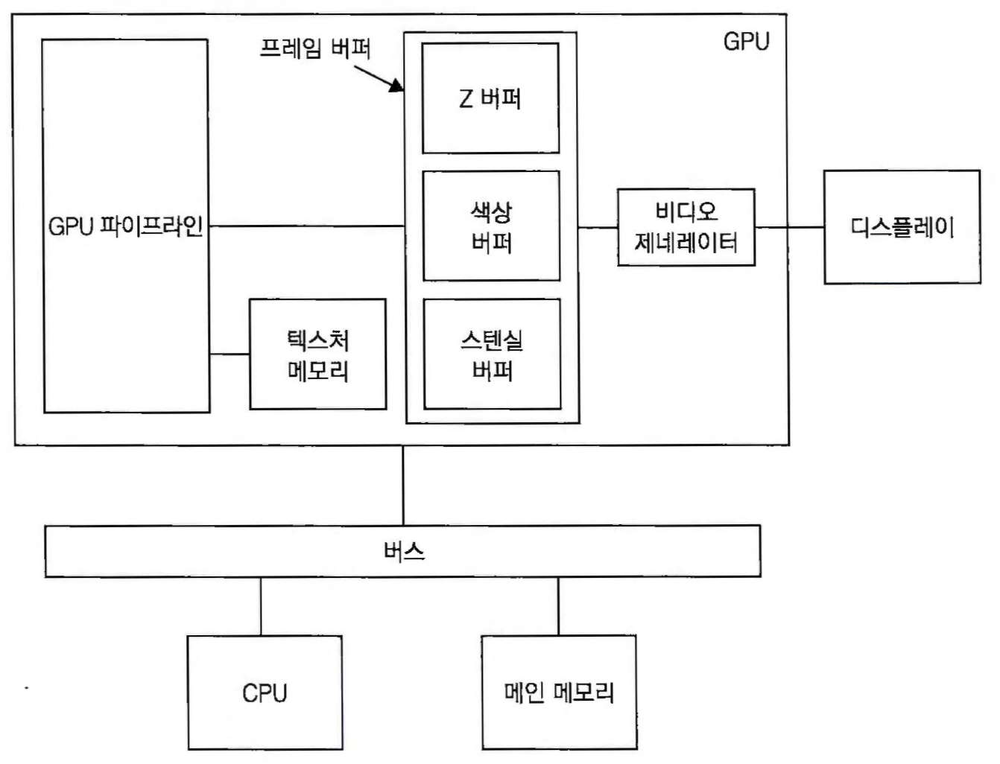
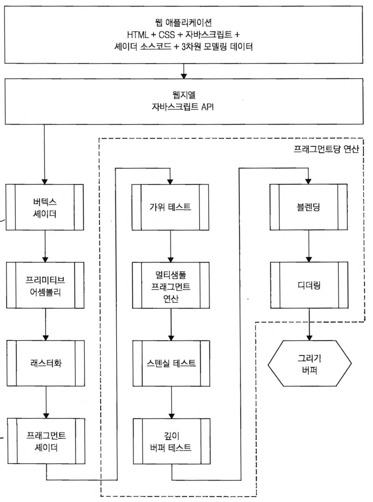

# WebGL Basic
브라우저에서 GPU 프로그래밍을 가능하게 하는 플랫폼

## CPU vs GPU
### Core

- CPU : 직렬처리 고성능 core ( 1,2,4~ )
- GPU : 병렬처리 저성능 core ( 수천~ )
### GPU 구조

- 색상버퍼 : 색상 정보를 담고 있는 스크린상의 각 픽젤 정보를 저장핸 직사각형 형태의 메모리 구조(RGB/RGBA)
- Z버퍼 : 
- 스텐실버퍼 : 특정위치에 오브젝트가 그려지는 모양을 조정( 그림자 표현 )
- 텍스쳐메모리
- 비디오컨트롤러

## WebGL 파이프라인

## 셰이더
- GPU에서 실행되는 프로그램
- 
## 행렬
### 버텍스셰이더

### 프레그먼트셰이더
### 프레그먼트 후처리

https://webgl2fundamentals.org/webgl/lessons/ko/webgl-fundamentals.html
https://codepen.io/pen/?editors=1010
